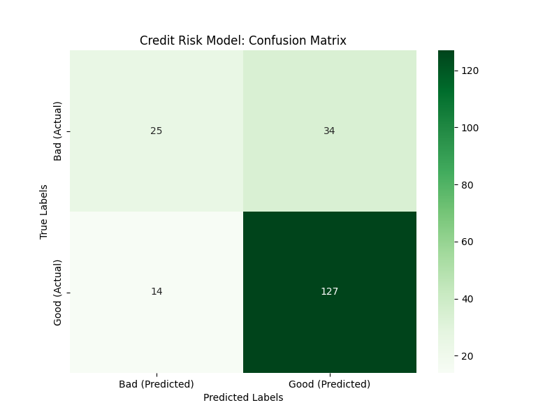

# 🏦 End-to-End Credit Risk MLOps Pipeline

This project is a production-ready Machine Learning service that predicts credit default risk using **XGBoost** and **FastAPI**.

## 🚀 Key Features

- **Automated Pipeline:** Data preprocessing, model training, and evaluation in one command.
- **REST API:** Real-time inference using FastAPI and Pydantic data validation.
- **Feature Alignment:** Robust reindexing logic to handle categorical mismatches and missing features.
- **Reproducible:** Fully managed environment via `requirements.txt`.

## 🛠️ Tech Stack

- **Language:** Python 3.11.9
- **Model:** XGBoost (Gradient Boosting)
- **API Framework:** FastAPI / Uvicorn
- **Libraries:** Pandas, Scikit-Learn, Joblib, Matplotlib

## 📊 Performance

The model currently achieves **76% Accuracy** on the German Credit Dataset.

